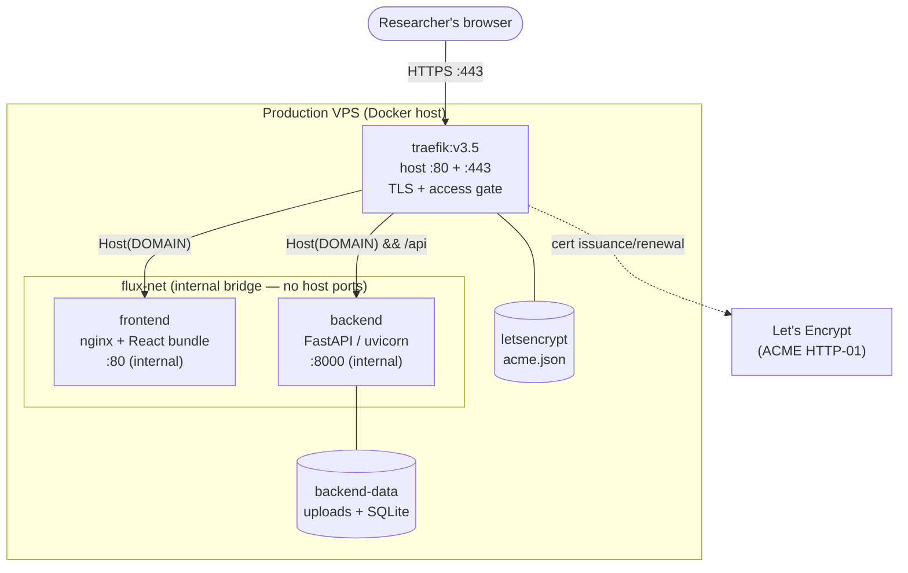
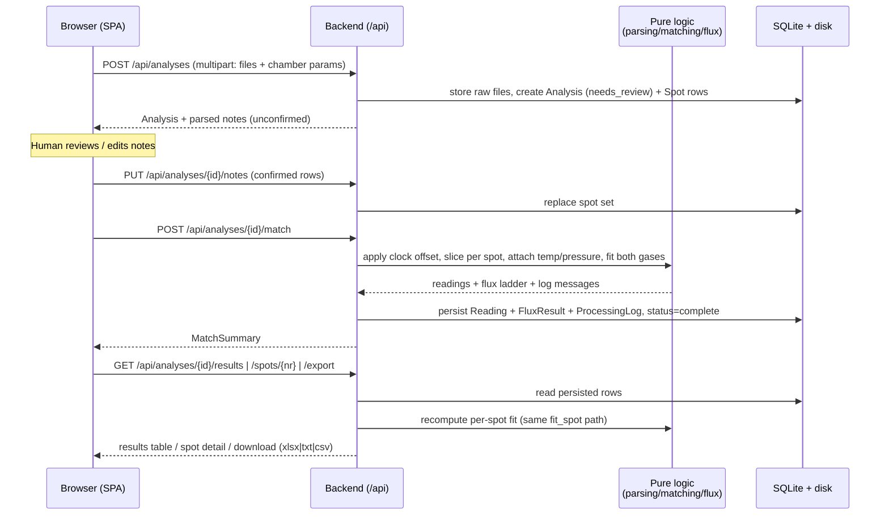
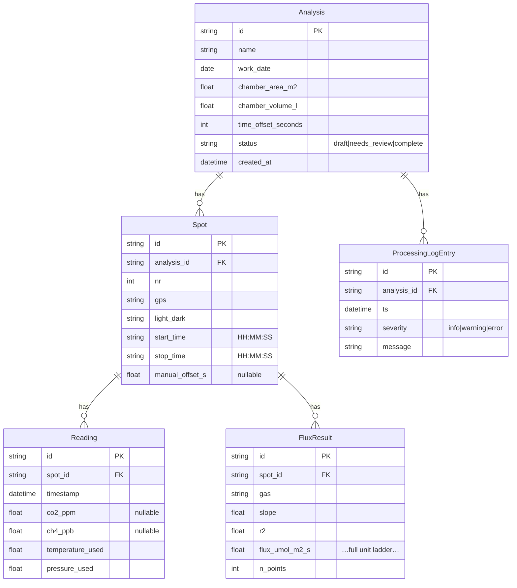
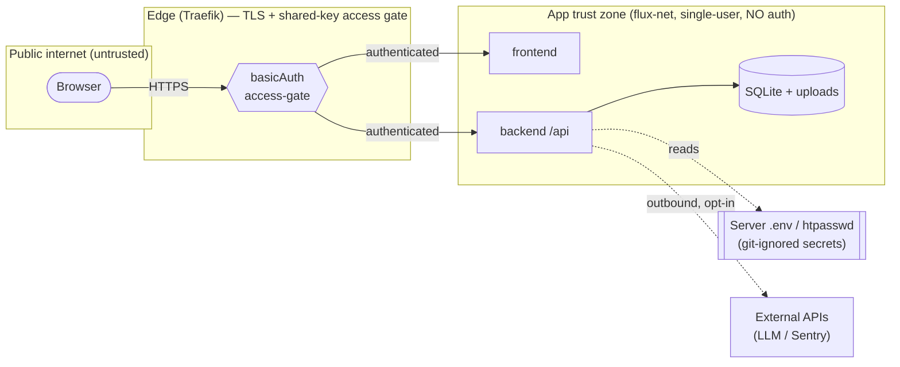

# Architecture

How Flux Calculation is put together: components, data flow, external services, the
database, the Docker/Traefik topology, and trust boundaries. Operational procedures
live in [`operations.md`](operations.md); the API contract is the generated
[`openapi.json`](openapi.json).

## Overview

Flux Calculation is a **local, single-user, desktop-style web tool**. A React SPA
talks over HTTP to a FastAPI backend, which parses raw field files, matches them by
timestamp, fits per-spot regressions, computes flux, and persists everything to a
single SQLite file. **The flux math is pure code and never LLM-touched;** an LLM (when
configured) only normalises messy notes/pressure into strict JSON, and its output is
always human-confirmed before use.

## Components

| Component | Tech | Responsibility |
|---|---|---|
| **Frontend** | React 19, Vite, TypeScript, Tailwind, Plotly | Upload → Confirm → Results flow; per-spot detail + processing log; all UI |
| **Backend** | Python 3.14, FastAPI, uvicorn | `/api` HTTP surface; parsing, matching, flux math, persistence, export |
| **Database** | SQLite via SQLModel | One file per install; raw uploads also kept on disk for re-runs |
| **Edge** | Traefik v3.5 | TLS termination (Let's Encrypt), routing, the shared-key access gate |
| **LLM** *(optional, deferred)* | Anthropic API | Normalise hand-typed notes/pressure → strict JSON (human-confirmed) |
| **n8n** *(optional, deferred)* | n8n | On-demand per-campaign AI quality check; app never depends on it |
| **Sentry** *(optional)* | Sentry SDK | Error/performance monitoring; off unless a DSN is set |

Backend package layout (pure logic kept out of routers): `parsing/` (LI-7810,
temperature, notes, pressure loaders), `matching/` (time-shift + auto-match), `flux/`
(regression + closed-chamber flux + unit ladder — the scientific core), `db/`
(SQLModel models + storage), `schemas/` (Pydantic request/response), `api/` (thin
routers), `core/` (config, logging, monitoring).

## Deployment topology

Routing (Traefik **file provider**, `traefik/dynamic.yml`): `…/api/*` → backend
(priority 100, prefix kept); everything else → frontend (catch-all). Only Traefik
binds host ports; the app containers are reachable only over `flux-net`. Companion
stacks (**n8n** at `…/n8n`, **Uptime Kuma** on localhost) run as separate Compose
projects — see [`operations.md`](operations.md).

## Request / data flow

The end-to-end pipeline the endpoints assemble:

Notes: the matching date comes from the **concentration file's own `DATE`**, not the
form's `work_date` (a wrong hand-typed date would otherwise put every window on the
wrong day). Pressure is **optional** — with none, flux uses a default sea-level
pressure and the spot is flagged `no_pressure`. Read endpoints recompute fits from the
persisted `Reading` rows via one shared `fit_spot` code path; `FluxResult` is the
durable record the export reads.

## Database

SQLite (one file, default `data/flux.db`), five tables, UUID4-hex primary keys.
Raw uploads live on disk at `data/<analysis_id>/<role>.<ext>` so any campaign is
re-runnable.

Schema changes are applied by a small **idempotent migration** on backend startup
(`session.py:_run_lightweight_migrations`, e.g. the `Spot.manual_offset_s ADD COLUMN`),
so a plain `docker compose up -d` migrates existing databases.

## External services

All external services are **optional**; the app runs fully without any of them.

- **LLM (Anthropic)** — normalises messy notes/pressure into strict JSON. Deferred
  (`TODO: seminar 6`); `LLM_API_KEY` stays blank until then. Its output is **always
  human-confirmed** before it drives any computation, and it **never** touches the flux
  math.
- **n8n** — on-demand per-campaign quality check. Results always compute/display
  without it; a missing check is a note on the results, never a failure.
- **Sentry** — error/performance monitoring, off unless `SENTRY_DSN` / `VITE_SENTRY_DSN`
  is set. Redacts sensitive values and stamps the request correlation id.

## Trust boundaries

Key points:

- **The only authentication is the edge access gate** — a single shared basic-auth
  key at Traefik, in front of the frontend, `/api`, and `/n8n`. The application itself
  is **local/single-user with no auth** by design; every `/api` endpoint is on the same
  trust level, so exposing it publicly relies entirely on the gate. (See the security
  section of [`../report.md`](../report.md) — `SEC-02`.)
- **Secrets never enter the repo or the client.** `LLM_API_KEY`, `SENTRY_DSN`,
  `SENTRY_AUTH_TOKEN`, and the access-gate hash live only in the untracked `.env` /
  `traefik/htpasswd` on the server. The browser Sentry DSN is public by nature and is
  the only "secret-shaped" value shipped in the bundle.
- **Logs are scrubbed.** Request/response bodies and query strings are never logged;
  sensitive keys are redacted on both sides (see [`operations.md`](operations.md) §5).
- **The scientific core is isolated.** `flux/` is pure, deterministic code, validated
  against an R method-of-record and locked by hand-computed test values — never
  LLM-touched.
- **Outbound calls are opt-in.** With no DSN / API key set, the backend makes no calls
  to Sentry or the LLM provider.
